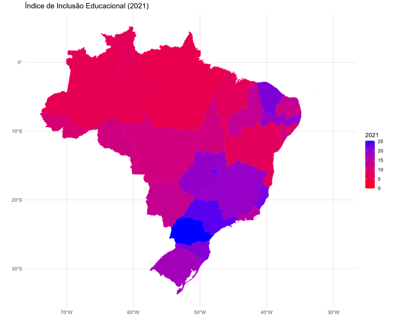
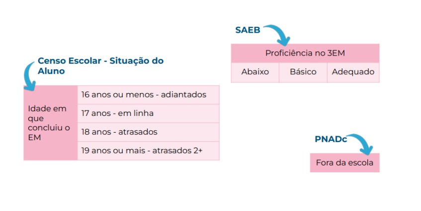
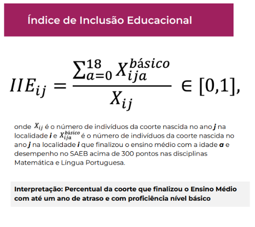
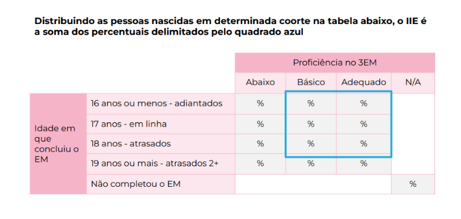

# IIE - Índice de Inclusão Educacional

## Contexto

O Instituto Natura tem investido esforços para a promoção de conhecimento e evidências da educação básica brasileira em suas diferentes segmentações, como educação infantil, alfabetização nos primeiros anos do ensino fundamental e ensino médio integral, assim como métricas que permitam a leitura da trajetória escolar básica completa. O objetivo desses esforços é aprimorar a visão integrada da educação, para apoiar o seu desenvolvimento tendo como horizonte a qualidade educacional com equidade de gênero, raça e diversidade.

No que se refere às métricas sobre as trajetórias escolares, o Instituto tem investido na produção de construtos analíticos que visam aferir com maior precisão a qualidade da educação básica considerando informações sobre acesso, permanência e desempenho dos estudantes brasileiros.

Nesse contexto, é criado o Índice de Inclusão Educacional (IIE). Esse índice representa a proporção dos nascidos em um determinado ano que concluiu o ensino médio com até 18 anos, com o nível de proficiência básico ou mais, conforme o SAEB.

O IIE fornece uma leitura ampla do cenário educativo no nível dos estados, quantificando não apenas os estudantes com desempenho adequado, mas também os atrasados e/ou com baixo desempenho educacional, incorporando na análise, de forma inovadora, aqueles que evadiram ao longo da trajetória escolar e são, comumente, ignorados nas análises educacionais.

## Metodologia

O IIE é uma métrica que avalia a proporção de indivíduos de uma coorte (nascidos em um determinado ano) que concluíram o Ensino Médio com até um ano de atraso e atingiram proficiência mínima em Matemática e Língua Portuguesa. Ele utiliza dados de diversas fontes, como o Censo Escolar, o SAEB e a PNADc.

### Microdados e Variáveis

#### Censo Escolar:

Determina a idade em que o Ensino Médio foi concluído:
* 16 anos ou menos (adiantados)
* 17 anos (em linha)
* 18 anos (atrasados)
* 19 anos ou mais (atrasados 2+)

#### SAEB:

Classifica a proficiência dos alunos no 3º ano do Ensino Médio:
* Abaixo do Básico: LP < 300 ou Mat < 300
* Básico: LP ≥ 300 e Mat ≥ 300, mas < 375
* Adequado: LP ≥ 375 e Mat ≥ 375

#### PNADc:

Estima o percentual de indivíduos que não completaram o Ensino Médio.

### Resumo:

### Cálculo
O IIE é calculado somando as porcentagens ajustadas dentro das categorias específicas:

### Distribuição da Coorte nas Categorias de Idade e Proficiência
Para cada faixa etária e nível de proficiência:

## Fonte dos dados
* [SAEB](https://www.gov.br/inep/pt-br/acesso-a-informacao/dados-abertos/microdados/saeb)
* [PNAD Contínua](https://www.ibge.gov.br/estatisticas/sociais/trabalho/17270-pnad-continua.html)
* Dados calculados na Sala Segura: [bases intermediárias extraídas da Sedap](./bases%20intermediárias%20extraídas%20da%20Sedap)

## Estudos produzidos

Na pasta "estudos" temos reunidos os estudos já realizados com o IIE.

## Resultados e código

Temos uma pasta "resultados" com os resultados para os IIE 2017, 2019 e 2021 já computados e o código divulgado em seu formato genérico no R para replicação do que já foi feito e disseminação de conhecimento e metodologia.

